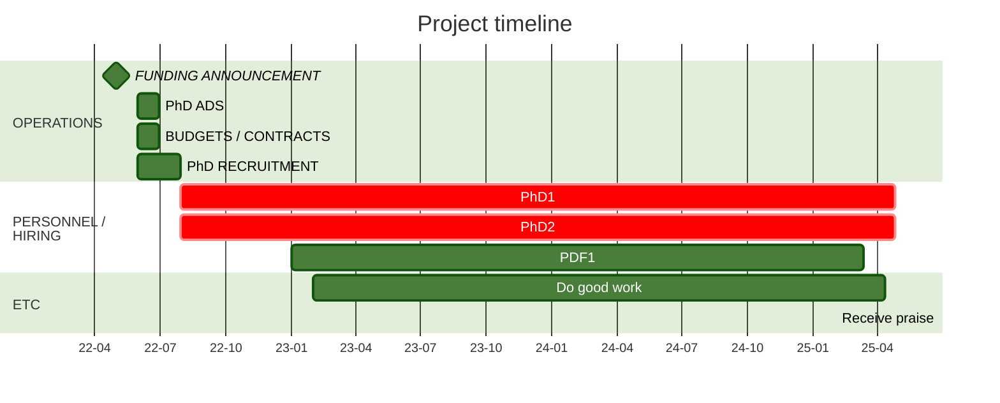

XX. Project Description
====================

Upload a Project Description with the headings detailed below and in no more than 10 A4 pages. NOTE: This is for the Discovery Scheme, others schemes have different headings / requirements and should be adapted accordingly. 

*Now remove any text from this area !*

PROJECT TITLE
-----------

This title may differ from that shown in Question A1 of the application
form and may exceed 10 words.

## PROJECT AIMS AND BACKGROUND

- Briefly outline the aims and provide the background of this
application.

- Include information about national and international progress in this
field of research and its relationship to this application.

- Refer only to research outputs that are accessible to the national
and international research communities.

### Background (subheadings work)

Introductory text with an embedded figure (and a label for the figure). `pandoc` generates a caption from the ALT text of a markdown figure which is slightly annoying because it won't show up in most markdown previewers. In addition, `pandoc` does not provide a good way to have images float with their captions and all that sort of thing. Don't bother trying to use `HTML` to make this work because it will get stripped out in converting to docx format (sorry).

{#fig:ModelEarth} 

The paragraph below shows how you cross reference this figure and how you cite a publication (for automatic inclusion in the references section).

The patterns that we see in the plate motions are very different from the patterns we see in a typical, slow-moving, slowly-rotating, convecting fluid. The reason for this is the temperature, stress and history dependence of the effective viscosity of silicate rocks particularly in the range of temperature and pressure conditions that apply in the upper thermal boundary layer (which we also know as the tectonic plates or the *lithosphere*). The most dramatic expression of the non-linearity in the rheology is that the plates  can be considered rigid to a first approximation [e.g. @deweyPLATETECTONICS1972] with all deformation localised into very narrow plate boundaries (see @fig:ModelEarth(A), data from @kreemerGeodeticPlateMotion2014). 

Equations in `pandoc` are in $TeX$ something like this (display, numbered)

$$
  \frac{\partial T}{\partial t} + \left(\mathbf{u} \cdot \nabla\right) T = \nabla^2 T  + h(\mathbf{x},t) 
$${#eq:example1}

The  $\left(\mathbf{\hat u} \cdot \nabla\right)$ operator in [@eq:example1] is the gradient in the direction of the velocity field at a point and so $\left(\mathbf{u} \cdot \nabla\right) T$ is the difference in the heat flux carried into and out of an elementary volume by $\mathbf{u}$. 

Bare equation numbers / figure numbers without the prefix use `-@eq:example1` in place of `@eq:example1`. [todo: Link to the documentation ...]

INVESTIGATOR(S)/CAPABILITY
--------------------------

Describe:

- Research Opportunity and Performance Evidence (ROPE);
- time and capacity to undertake the research;
- evidence of experience in research training, mentoring and supervision (where appropriate); and
- the capability of the investigator or team to build collaborations both within Australia and internationally.

PROJECT QUALITY AND INNOVATION
-----------------------------

Describe the:

- contribution to an important gap in knowledge or significant problem;
- novelty/originality and innovation of the proposed research
(including any new methods, technologies, theories or ideas that will be
developed);
- clarity of the hypothesis, theories and research questions;
- cohesiveness of the project design and implementation plan (including
the appropriateness of the aim, conceptual framework, method, data
and/or analyses); and
- extent to which the research has the potential to enhance
international collaboration.

BENEFIT
-------

Describe the potential benefits including the:
- new or advanced knowledge resulting from outcomes of the research;
- economic, commercial, environmental, social and/or cultural benefits
for Australia and international communities; and
- potential contribution to capacity in the Australian Government
priority areas.

FEASIBILITY
--------

Describe the:

- cost-effectiveness of the research and its value for money;
- suitability of the environment for the research team and their
project, and for HDR students where appropriate;
- availability of the necessary facilities to complete the project; and
- extent to which the project's design, participants and requested
budget create confidence in the timely and successful completion of the
project.

If the project involves research pertaining to Aboriginal and/or Torres
Strait Islander communities describe:

- the strategies for enabling collaboration with Aboriginal and/or
Torres Strait Islander communities (for example, dialogue/collaboration
with an Indigenous cultural mentor);
- any existing or developing, supportive and high-quality relationships
with Aboriginal and/or Torres Strait Islander communities; and
- any personal affiliations with local Aboriginal and/or Torres Strait
Islander communities that facilitate the proposed research.

### Project Plan & Budget

You can include mermaid to build a project timeline, but only if you install the plugin using `npm`

COMMUNICATION OF RESULTS
---------------------

- Outline plans for communicating the research results to other
researchers and the broader community, including but not limited to
scholarly and public communication and dissemination.

REFERENCES
---------

<!-- don't touch this ! -->

:::{#refs}
:::

<!-- This exact format is required for pandoc to substitute the references. These are tagged with a specific style in the docx which allows them to be formatted as required -->

ACKNOWLEDGEMENTS
----------------

Optional section (remove heading if not required)
